<!-- ================= HUD HEADER ================= -->
<p align="center">
  
</p>

<p align="center">
  
</p>

<p align="center">
  <a href="mailto:ps2894944@gmail.com"></a>
  <a href="https://www.linkedin.com/in/priyanshu-singh-3a6777212/"></a>
  
</p>

<p align="center"></p>

## 🛡️ Pilot Profile

```yaml
callsign   : Priyanshu Kumar Singh
class      : AI Engineer - GenAI and Backend
base       : Nippon Data Systems, AI and Analytics Division
suit_modules:
  - Newton WorkAI     # multi-tenant conversational AI
  - Newton ProcessAI  # intelligent document processing
  - Newton ATS AI     # resume scoring and CV search
  - Vigil Eyes        # real-time safety vision
training   : MCA @ Manipal University Jaipur
ninja_way  : "Never ship without a benchmark."
```

<p align="center"></p>

## ⚡ Power Readings

<p align="center">
  
  
  
  <br/>
  
  
  
  
</p>

<p align="center"></p>

## 🌀 Jutsu Arsenal

<details open>
<summary><b>🔥 Generative AI Techniques</b></summary>
<br/>
<p>
  
  
  
  
  
  
  
  
</p>
<sub>RAG · Agentic AI · Tool Calling · NL→SQL · Hybrid Search · Reranking · LLM Evaluation</sub>
</details>

<details open>
<summary><b>⚙️ Backend and Cloud Armor</b></summary>
<br/>

</details>

<details open>
<summary><b>👁️ Vision and NLP Senses</b></summary>
<br/>

&nbsp;


</details>

<p align="center"></p>

## 📜 Mission Scrolls

<table>
<tr>
<td width="50%" valign="top">

### 🎙️ saarAI
Hinglish transcription with Deepgram Nova-3 plus a RAG *Strategic Memory* that forges MoMs, SWOTs and decision logs.

`LangChain` `Deepgram` `PostgreSQL` `Docker`

</td>
<td width="50%" valign="top">

### 🎮 4-in-a-Row
Real-time multiplayer: WebSocket sync, Kafka event streams, Minimax AI opponent, MongoDB state.

`Node.js` `Kafka` `WebSockets` `MongoDB`

</td>
</tr>
<tr>
<td width="50%" valign="top">

### 🎯 AOTS
YOLOv8 + CSRT tracking that keeps a lock on every target across frames, streamed live over Flask.

`YOLOv8` `OpenCV` `Flask`

</td>
<td width="50%" valign="top">

### 📊 Activity Timeline
Zero-shot activity classification from free text with temporal analytics dashboards.

`Transformers` `NLP` `Streamlit`

</td>
</tr>
</table>

<p align="center"></p>

## 🎓 Training Grounds

**Manipal University Jaipur** · MCA · 2025 to 2027 &nbsp;|&nbsp; **Galgotias University** · BCA (AI and ML) · CGPA 8.08

🏅 MongoDB GenAI Apps · IBM AI Fundamentals · AWS Cloud Foundations · AWS ML Foundations · OpenCV Bootcamp

<p align="center">
  
</p>

<p align="center">
  
</p>
